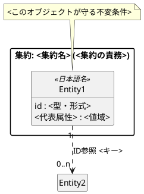

# 成果物の様式

設計ディレクトリ 1 つ (`docs/design/<name>/`) が持つファイルと、それぞれの書式。SKILL.md の手順から Read される。

## 配置骨格

```
docs/design/<name>/
├── README.md          # 索引 + ドメインモデル図の貼付 + 検証シナリオ + 用語集 (条件付き)
├── system.md          # システム関連図 (境界・port の表)
├── usecases.md        # ユースケース (テキスト。図は置かない)
├── domain.puml        # ドメインモデル図の正本
├── domain.svg         # 描画結果 (生成物。domain.puml と必ず対で更新する)
├── statechart.puml    # 状態機械を持つ設計のみ。描画結果 statechart.svg も同様
└── decision/
    └── NNNN-<slug>.md # 設計局所の決定記録 (1 決定 1 file・不変)
```

## README.md

設計ディレクトリの入口。次の節を持つ:

1. **導入**: 何の設計か 1〜2 段落。設計手法 (システム関連図 → ユースケース → ドメインモデル図 の順で作る) は名乗るだけでよい — 手法の説明は書かない
2. **索引**: file / 中身 の 2 列表。**この表が更新時の正本対応表を兼ねる** — 「何を変えるときどの file を先に直すか」が読めるよう、各行の「中身」に扱う構造 (境界 / ユースケース / entity・多重度・状態機械) を書く
3. **ドメインモデル図の貼付**: `[](domain.svg)` でクリック時に等倍で開く形。正本は `.puml` 側で `.svg` は生成物であること、直すのは source 側であることを 1 行添える
4. **用語集** (リポジトリに用語の正本が無い場合のみ): 下記「用語集」
5. **検証シナリオ**: [verification.md](verification.md) の様式
6. **省略の宣言** (成果物を省いた場合のみ): 何を省き、なぜその設計では不要かを 1 行ずつ

## system.md — システム関連図

図ではなく**表**で書く (ASCII 図は罫線の桁揃えが壊れやすく、表なら diff も編集も安定する)。

1. **システム境界**: どこに境界を引くか、境界の外に居るアクターは誰か。境界の置き方自体が設計判断なので、理由を添える
2. **システム × 相手 × 方向 の表**:

   | 相手 | 境界 | 経由 | 方向 | やり取りするもの |
   |---|---|---|---|---|

   経由列には port (交換可能にしたい接続点) を置き、port にしない相手はその旨を書く。port の切り方は変動性 (volatility) で決め、判断を表の下に残す
3. **状態機械** (持つ設計のみ): 状態の一覧と遷移の主系列をテキストで。正本の図は `statechart.puml`
4. **解こうとしている構造課題** (既存機構の置き換えなら): 現行の何が問題かを列挙する

**却下肢は該当節に織り込む**: 「却下: <案>。理由: <理由>」を、その決定を述べた節の直後に置く。decision/ に上げるのは下記「decision/」の基準を満たすものだけで、満たさない却下肢の置き場はこの織り込みになる。

## usecases.md — ユースケース

Cockburn (Writing Effective Use Cases) の fully dressed を縮約した形。**テキストが中心成果物で、図は置かない。**

- 1 ユースケース = 1 見出し。フィールドは **Primary Actor / Scope / Level / Trigger / 事前条件 / 成功保証** を箇条書きで固定する
- **Main Success Scenario**: 番号付きリスト。1 ステップ 1 文・アクターを明記・**意図**を書く (どの tool をどう呼ぶかの詳細は書かない)。**3〜9 ステップ**に収める。超えるならユースケースを分割する
- **Extensions**: 分岐点を `<step 番号><英字>` で示し (例 `2a.`)、内部ステップは `2a1.` 形式。復帰先を明記する
- **Level は user-goal 固定**。単独の操作 (サブ機能) には降りない — それらは user goal の Main Success Scenario の 1 ステップとして現れる
- Scope は全ユースケースで設計対象システムに固定する。システムを使う側 (人間・外部システム) は境界の外のアクター
- 冒頭にこの記述規約を置く (読み手が規約を探しに来なくて済む)

## domain.puml — ドメインモデル図

PlantUML の簡略クラス図。冒頭コメントに次の記述規約を書き、本文が従う:

1. **全属性に `{field}` を必須とする。** PlantUML は `()` の有無でフィールド / メソッドを判定するため、`(gh#386)` のような括弧を含む属性は `hide methods` 系の設定下でメソッド扱いされ、画像から無言で消える (構文検査は exit 0 のまま)。`scripts/render-puml.py` がこの規約を機械検査する
2. **検査は必ず exit code で判定する。** `-tsvg` / `-tpng` は syntax error でもエラー画像を生成して exit 0 を返しうるので、生成物の有無を成功判定に使わない

書く装置は 4 つ:

- **簡略クラス図**: 代表属性のみ・メソッドは書かない (`hide circle` / `hide empty members`)
- **ルールと制約は note** で所有オブジェクトに束縛する (そのオブジェクトが実装する)
- **集約は package 枠**で囲む
- **集約間は ID 参照** (`..>`) + **多重度**

骨格:



## statechart.puml — 状態遷移図 (状態機械を持つ設計のみ)

`scripts/check-statechart.py` が検査できる記法の範囲で書く (対応記法・`uncovered` 宣言の形は script の `--help` が正本)。**未定義にする組合せには理由の宣言が要る** — 検査の意図と使い方は [verification.md](verification.md)。

## 用語集

用語の正本はリポジトリに 1 箇所。**既存の用語集 (CONTEXT.md / glossary.md 等) があればそちらへ追記**し、設計ディレクトリからは参照する。無ければ README.md 内に対訳表を置く:

| 語 | 日本語 | 意味 |
|---|---|---|

- ドメインモデル図に登場する語 (entity 名・状態名・イベント名) は全部この表に載せる — 図の語彙と地の文の語彙のずれが、実装時の名前の割れになる
- 設計中の新造語のために用語集ファイルを新設しない (設計が固まってから、リポジトリの運用に従って昇格する)

## decision/ — 決定記録

設計セッション中の決定のうち、**根拠と却下肢を残す価値があるもの**を 1 決定 1 file で蓄積する。file 名は `NNNN-<slug>.md` (4 桁連番)。**記録は不変** — 覆すときは新しい決定 file を起こし、旧 file の Status を Superseded にする。

```markdown
# NNNN. <決定を 1 文で>

- Status: Accepted | Superseded by NNNN
- Date: YYYY-MM-DD

## 決定

<何をどうすると決めたか>

## 根拠

<なぜその選択か>

## 却下した代替案

- <案>: <却下理由>
```

- **リポジトリ全体の ADR へ昇格する基準**: 決定がこの設計の外 (実装全体・他コンポーネント) を縛り、かつ覆すコストが大きいもの。昇格したら decision/ 側の file は本文を ADR への参照 1 行に置き換える (二重記述にしない)。ADR の起票はリポジトリの運用に従う
- 昇格基準に満たない小さな却下肢は file を起こさず、system.md の該当節に「却下: 〜」で織り込む
