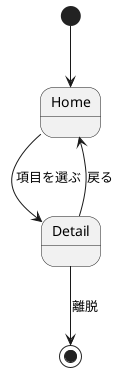

# 成果物の様式

設計ディレクトリ 1 つ (`docs/design/<name>/`) が持つファイルと、それぞれの書式。SKILL.md の手順から Read される。

**表の列と ID の書式は `scripts/check-ui-design.py` が機械検査する。** 列名・見出しを変えると検査が読めなくなるので、様式は本書に合わせる。

## 配置骨格

```
docs/design/<name>/
├── README.md          # 索引 + 画面遷移図の貼付 + 操作シナリオ + 省略の宣言
├── screens.md         # 画面インベントリ (画面一覧表 + 画面ごとの領域構成)
├── navigation.puml    # 画面遷移図の正本 (状態遷移図の記法)
├── navigation.svg     # 描画結果 (生成物。navigation.puml と必ず対で更新する)
├── components.md      # component 一覧 (出現画面・state) + 画面との対応
├── tokens.md          # デザイントークン (front matter = 規範値、本文 = 適用文脈)
└── decision/
    └── NNNN-<slug>.md # 設計局所の決定記録 (1 決定 1 file・不変)
```

`sud-design` の成果物 (`system.md` / `usecases.md` / `domain.puml`) が同じディレクトリにあってもよい。両 skill は置き場を共有し、ファイル名が重ならない。

## 画面 ID の書式

画面 ID は設計ディレクトリを通じて 1 つの名前空間。`screens.md` の表・`navigation.puml` の状態名・`components.md` の出現画面列が同じ ID を使う。

- 使える文字は英数字・`_`・`.` (PlantUML の状態名として使えるため)。日本語の表示名は別列に置く
- 画面でないもの (modal / drawer / toast) も、遷移の宛先になるなら ID を持たせて画面と同じ扱いにする。宛先にならないなら component 側に書く

## README.md

設計ディレクトリの入口。次の節を持つ:

1. **導入**: 何の UI 設計か 1〜2 段落。設計手法 (画面インベントリ → 画面遷移 → 領域 → component → トークン の順で作る) は名乗るだけでよい — 手法の説明は書かない
2. **索引**: file / 中身 の 2 列表。**この表が更新時の正本対応表を兼ねる** — 「何を変えるときどの file を先に直すか」が読めるよう、各行の「中身」に扱う構造 (画面 / 遷移 / component・state / トークン) を書く
3. **画面遷移図の貼付**: `[](navigation.svg)` でクリック時に等倍で開く形。正本は `.puml` 側で `.svg` は生成物であること、直すのは source 側であることを 1 行添える
4. **操作シナリオ**: [verification.md](verification.md) の様式
5. **省略の宣言** (成果物を省いた場合のみ): 下記の逐語の形で 1 行ずつ。**`check-ui-design.py` がこの行を探す** — 無い file について宣言が無ければ違反:

   ```markdown
   - 省略: components.md — 単一画面で再利用する部品が無いため
   ```

## screens.md — 画面インベントリ

**画面一覧**の表と、画面ごとの領域構成を持つ。

```markdown
## 画面一覧

| ID | 画面名 | 目的 | 主な情報要素 |
|---|---|---|---|
| Home | トップ | 未ログイン者が何のサービスか判断する | 価値提案 / CTA / 料金 |
| Detail | 詳細 | 対象 1 件の内容を読む | 本文 / 関連 / 操作 |
```

- **目的は「誰が何をしに来るか」**で書く。画面名の言い換え (「詳細を見る画面」) は目的ではない
- `usecases.md` があるなら、目的列にユースケース名を織り込んで対応を読めるようにする

画面ごとに節を 1 つ持ち、領域構成と breakpoint の畳み方を書く:

```markdown
### Home

| 領域 | 中身 | 640px 未満 |
|---|---|---|
| header | logo / nav | nav を drawer へ畳む |
| main | hero / 特徴 3 列 | 1 列に積む |
```

- 領域は役割名 (header / nav / main / aside / footer) で書く。ピクセル値のレイアウトは書かない — それは実装の判断
- **ASCII の wireframe は置かない** (桁揃えが壊れやすく、更新されずに腐る)。領域の構造は表で足りる

トークンを名指しするときは `` `--token-name` `` の形で書く (この表記だけが検査対象)。

## navigation.puml — 画面遷移図

**状態遷移図の記法で書く** — 画面 = 状態、操作 = イベント。これにより `sud-design/scripts/check-statechart.py` が遷移の網羅と到達不能画面を検査できる。対応記法と `uncovered` 宣言の形は同 script の `--help` が正本。



- **状態名は画面 ID そのもの**。表示名を出したいときは `state "詳細" as Detail` を使う
- modal / drawer を状態として持つか component 側に置くかは、遷移の宛先になるかで決める (artifacts の「画面 ID の書式」)

## components.md — component 分解

**component 一覧**の表 1 つが中心成果物。

```markdown
## component 一覧

| component | 種別 | 出現画面 | state |
|---|---|---|---|
| PrimaryButton | Button | Home, Detail | default, hover, focus-visible, active, disabled, loading |
| SearchInput | Input | Home | default, hover, focus, error, disabled, read-only |
| Breadcrumb | - | Detail | default |
```

- **種別**は必須 state 表 (SKILL.md) の名前 (`Button` / `Input` / `Link` / `Checkbox` / `Radio` / `Modal` / `Alert`) か、当てはまらなければ `-`。種別を名乗った component は**その必須 state を全部列挙する** (`check-ui-design.py` が検査する)
- **出現画面**は画面 ID をカンマ区切り (`/` 区切りでも読む — SKILL.md の必須 state 表を写すと `/` になるため、state 列・種別列と同じ扱いにしてある)。`screens.md` に無い ID は違反。**どの画面にも現れない component は書かない** — 書くなら画面側に現れるべきで、現れないなら設計から落とす
- state は種別の必須分に加えて、その component 固有の state を足してよい

component が受け取る情報 (props 相当) が設計判断として要るものは、component ごとの節に箇条書きで足す。**型は書かない** — 実装の判断。

## tokens.md — デザイントークン

front matter (機械可読な規範値) と本文 (適用文脈) の 2 層。front matter の schema は [DESIGN.md format](https://github.com/google-labs-code/design.md) の token schema に合わせる — `@google/design.md` CLI の `export` (Tailwind / DTCG) 経路が開く。

```markdown
---
name: <設計対象の名前>
colors:
  primary: "#0B6BCB"
  background: "#FFFFFF"
  foreground: "#101418"
typography:
  fontFamily: "system-ui, sans-serif"
  scale: 1.25
spacing:
  base: 8
rounded:
  md: 6
---

## トークンの層

| 層 | 例 | 決め方 |
|---|---|---|
| primitive | `--blue-9` | palette から機械的に生成する。画面からは直接参照しない |
| semantic | `--primary` / `--background` | primitive を役割へ束ねる。画面・component が参照するのはこの層 |
| component | `--button-bg` | semantic で足りないときだけ作る |

## 選定と理由

| 項目 | 選定 | 理由 (どの画面要求に由来するか) |
|---|---|---|
| palette | Radix Blue | 画面一覧の目的が「信頼して申し込む」で、trustworthy 側の hue を採る |
| type scale | 1.25 (Major Third) | 見出し 3 階層で足り、1.333 は h1 が hero を圧迫する |
```

- **semantic 層の名前が、他の成果物から参照される唯一の語彙**。`screens.md` / `components.md` が `` `--foo` `` で名指しした token は、この file に現れなければ違反
- **`check-ui-design.py` は front matter を読まない** — 本文中の `--name` 表記だけを定義済みとみなす。front matter は DESIGN.md 形式の機械可読な値 (`colors.primary`) で、CSS 変数名 (`--primary`) との対応は自動では取れないため。**他の成果物から名指しする token は、本文の「トークンの層」表にも `--name` で載せる**
- 実装形式 (CSS custom properties / Tailwind `@theme` / shadcn) ごとの骨格は `references/scale-templates/` にある。必要なら CSS を同ディレクトリへ書き出してよいが、**正本は tokens.md 側**

## decision/ — 決定記録

設計セッション中の決定のうち、**根拠と却下肢を残す価値があるもの**を 1 決定 1 file で蓄積する。file 名は `NNNN-<slug>.md` (4 桁連番)。**記録は不変** — 覆すときは新しい決定 file を起こし、旧 file の Status を Superseded にする。

```markdown
# NNNN. <決定を 1 文で>

- Status: Accepted | Superseded by NNNN
- Date: YYYY-MM-DD

## 決定

<何をどうすると決めたか>

## 根拠

<なぜその選択か>

## 却下した代替案

- <案>: <却下理由>
```

- **リポジトリ全体の ADR へ昇格する基準**: 決定がこの設計の外 (実装全体・他コンポーネント) を縛り、かつ覆すコストが大きいもの。昇格したら decision/ 側の file は本文を ADR への参照 1 行に置き換える (二重記述にしない)。ADR の起票はリポジトリの運用に従う
- 昇格基準に満たない小さな却下肢は file を起こさず、該当成果物の節に「却下: 〜」で織り込む
